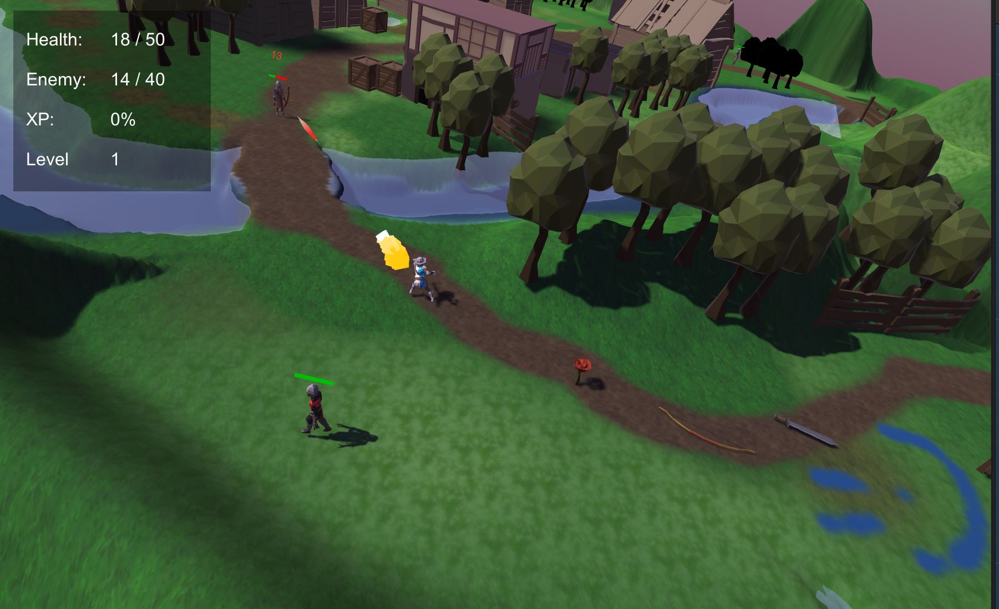
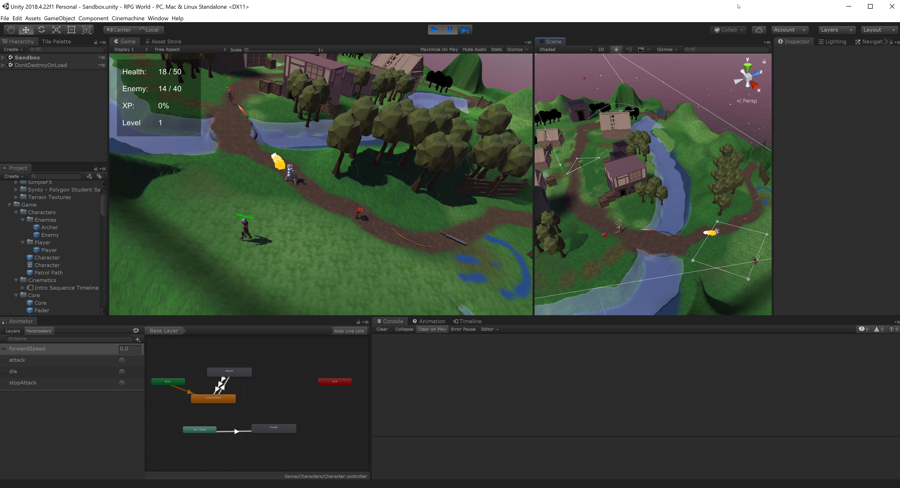

# 3D RPG World Unity Game

Repository contains code for RPG world game build in unity.

Game was created following learnings from [Udemy RPG Core Unity course](https://www.udemy.com/course/unityrpg/).

The game contains the following features:
* Levelling up
* Experience points from mobs
* Configurable stats for damage, health, etc based on damage (via unity yaml)
* Multiple levels via scenes with travel via portal
* Saving and load state for objects in scenes

Built using Unity 2018.4.22f1

